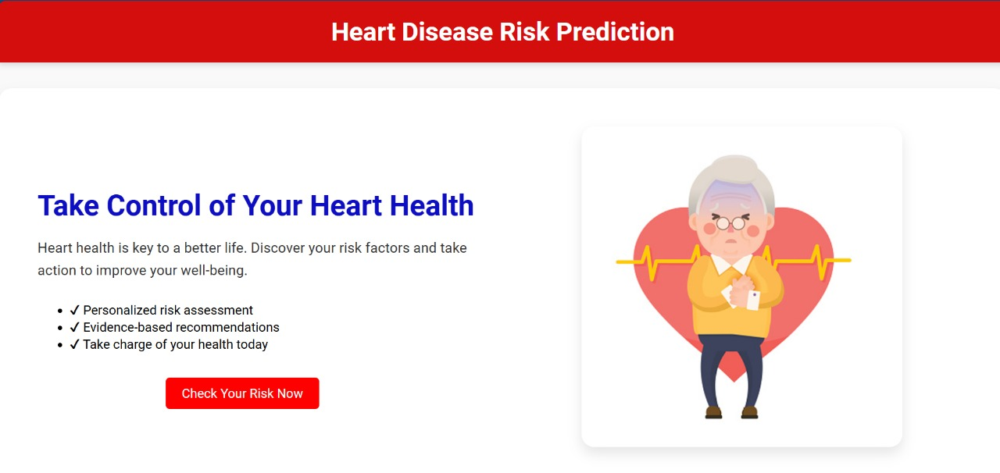
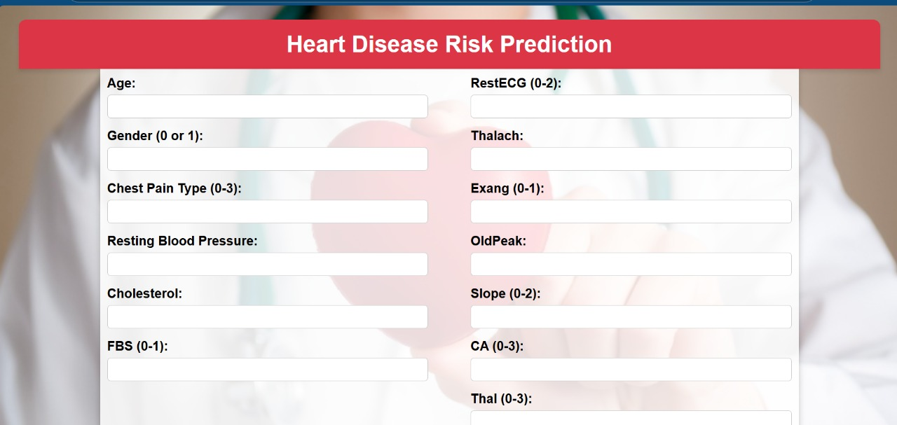
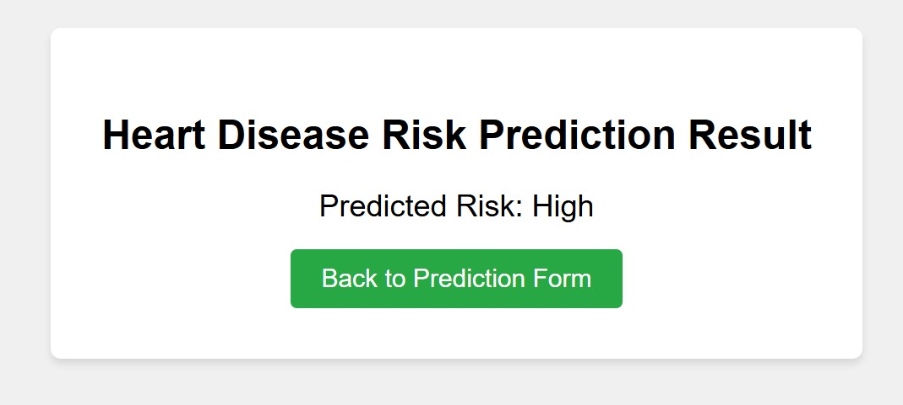

**Heart Disease Risk Prediction using Ensemble Learning**

## **Overview**
Heart disease is a major health concern worldwide, and early detection can save lives. This project predicts the risk of heart disease using ensemble learning, which combines multiple machine learning algorithms to improve prediction accuracy.  
The ensemble model incorporates the following algorithms:  
- **Neural Network (NN)**  
- **K-Nearest Neighbors (KNN)**  
- **Support Vector Machine (SVM)**  
- **Logistic Regression**  
- **Random Forest**  

This project is designed to be user-friendly, featuring an interactive interface for inputting patient data and receiving real-time predictions.

---

## **Dataset**  
- **Source**: [Heart Disease Dataset](https://www.kaggle.com/code/kristiannova/heart-disesase-try?select=heart.csv) from Kaggle.  
- **Features**:  
  - Clinical and diagnostic attributes such as age, gender, cholesterol levels, blood pressure, chest pain type, and more.  
- **Target**: Predicts whether the risk of heart disease is **High** or **Low**.  

---

## **Technologies Used**  
- **Frontend**: HTML, CSS, JavaScript  
- **Backend**: Flask (Python)  
- **Machine Learning**: TensorFlow/Keras, Scikit-learn  

---

## **Project Structure**  
```plaintext
HeartDiseasePrediction/
├── dataset/
│   └── heart.csv
├── models/
│   ├── nn.keras
│   ├── svm.pkl
│   ├── knn.pkl
│   ├── randomForest.pkl
│   ├── logistic.pkl
│   └── ensemble.pkl
├── static/
│   └── style.css
├── templates/
│   ├── form.html
│   ├── result.html
├── app.py
├── README.md
└── requirements.txt
```

---

## **Installation**  
### **Prerequisites**  
- Python 3.8 or later  
- `pip` package manager  

### **Steps**  
1. Clone the repository:  
   ```bash
   git clone https://github.com/drv44/HeartRiskPredictorML.git
   cd HeartRiskPredictorML
   ```
2. Install dependencies:  
   ```bash
   pip install -r requirements.txt
   ```
3. Start the Flask server:  
   ```bash
   python app.py
   ```
4. Open the application in your browser at `http://127.0.0.1:5500`.

---

## **Usage**  
1. Access the **Prediction Form** page in your browser.  
2. Enter patient information such as age, cholesterol, blood pressure, and more.  
3. Submit the form to receive a prediction of heart disease risk (High/Low).   

---

## **Model Details**  
- **Neural Network**: Built using TensorFlow/Keras with three hidden layers.  
- **K-Nearest Neighbors (KNN)**: Configured with 5 neighbors.  
- **Support Vector Machine (SVM)**: Uses the RBF kernel for classification.  
- **Logistic Regression**: Utilizes L2 regularization.  
- **Random Forest**: Trained with 100 decision trees.  
- **Ensemble Method**: Final prediction is based on a weighted voting system.  

---

## **Results**  
The ensemble model achieves the following metrics:  
- **Accuracy**: 0.9121951219512195
- **Precision**: 0.7878787878787878 
- **Recall**: 0.9310344827586207
- **F1 Score**: 0.8534954407635434

- 
- 
- 

---

## **Future Improvements**  
- Include additional features like lifestyle and genetic data.  
- Deploy the project as a web service for global accessibility.  
- Add data visualizations to better understand risk factors.  

---

## **Acknowledgments**  
- [Kaggle](https://www.kaggle.com) for providing the dataset.  
- Open-source libraries like Scikit-learn and TensorFlow for enabling efficient model development.  

